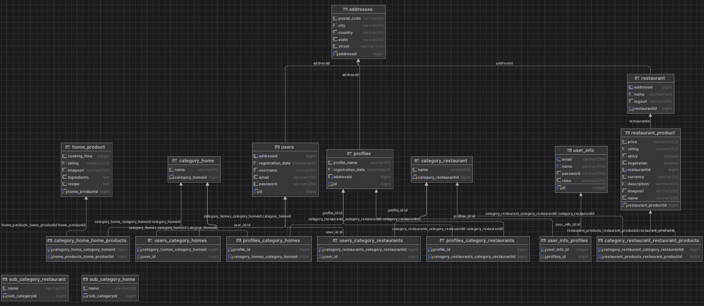

# CookOrGo

CookOrGo to aplikacja kulinarna, która pomaga użytkownikom znaleźć przepisy na dania z dostępnych składników lub podpowiada, co można zamówić na podstawie aktualnych miejsc w twojej okolicy.

## Spis treści

- [Wymagania](#wymagania)
- [Instalacja](#instalacja)
- [Uruchamianie](#uruchamianie)
- [Korzystanie z aplikacji](#korzystanie-z-aplikacji)
- [Funkcje](#funkcje)
- [Dokumentacja API](#dokumentacja-api)
- [Licencja](#licencja)

## Wymagania

Aby uruchomić aplikację, musisz mieć zainstalowane:

- Java 11 lub nowsza
- Maven
- Baza danych (np. PostgreSQL)

## Instalacja

1. Sklonuj repozytorium:

```bash
git clone https://github.com/twoje-konto/CookOrGo.git
cd CookOrGo
```
## Uruchamianie

Aplikacja zostanie uruchomiona na `http://localhost:8080`.

## Korzystanie z aplikacji

1. Zaloguj się na swoje konto lub utwórz nowe.
2. Przeglądaj dostępne przepisy kulinarne lub.
3. Dodawaj przepisy lub produkty do swojej listy.
4. Złoż zamówienie.
5. Wyszukaj lub Gotuj pyszne dania!

   
## Funkcje
 
  
 
 
 
 
 
## Dokumentacja API

Aplikacja udostępnia API, którego dokumentację znajdziesz pod adresem `http://localhost:8080/swagger-ui.html`. Możesz tam przeglądać dostępne endpointy i testować je.



## Licencja

Ten projekt jest dostępny na licencji MIT. Szczegółowe informacje znajdziesz w pliku [LICENSE](LICENSE).
